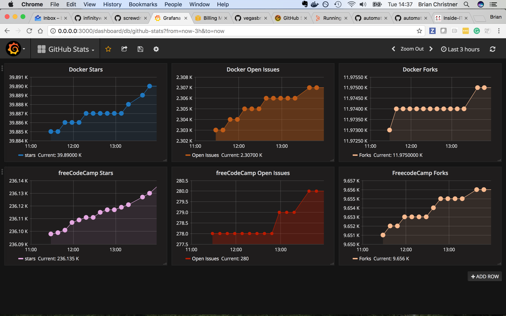

# A Docker Stack which Monitors your home network
Here's a quick start to stand-up a Docker [Prometheus](http://prometheus.io/) stack containing Prometheus, Grafana with  [blackbox-exporter](https://github.com/prometheus/blackbox_exporter) and [speedtest-exporter](https://github.com/stefanwalther/speedtest-exporter) to collect and graph home network connections and speed.

## Pre-requisites
Before we get started installing the Prometheus stack. Ensure you install the latest version of docker and [docker-compose](https://docs.docker.com/compose/install/) on your Docker host machine. This has been tested with Docker for Mac and Synology and it works.

# Quick Start

If on Mac run this:

```
git clone https://github.com/maxandersen/internet-monitoring && cd internet-monitoring/prometheus && docker-compose up && open http://localhost:3030/d/o9mIe_Aik/internet-connection
```

otherwise:

```
git clone https://github.com/maxandersen/internet-monitoring
cd internet-monitoring/prometheus
docker-compose up
```

Goto [http://localhost:3030/d/o9mIe_Aik/internet-connection](http://localhost:3030/d/o9mIe_Aik/internet-connection) (change `localhost` to your docker host ip/name).

## Configuration
To change what hosts you ping you change the `targets` section in [/prometheus/pinghosts.yaml](./prometheus/pinghosts.yaml) file.

For speedtest the only relevant configuration is how often you want the check to happen. It is at 5 minutes by default which might be too much if you have limit on downloads. This is changed by editing `scrape_interval` under `speedtest` in [/prometheus/prometheus.yml](./prometheus/prometheus.yml).


Once configurations are done let's start it up. From the /prometheus project directory run the following command:

    $ docker-compose up -d

That's it. docker-compose builds the entire Grafana and Prometheus stack automagically. 

The Grafana Dashboard is now accessible via: `http://<Host IP Address>:3030` for example http://localhost:3030

username - admin
password - wonka (Password is stored in the `config.monitoring` env file)

The DataSource and Dashboard for Grafana are automatically provisioned. 

If all works it should be available at http://localhost:3030/d/o9mIe_Aik/internet-connection - if no data shows up try change the timeduration to something smaller.

<center></center>

## Interesting urls

Note: replace `localhost` with your docker host ip/name if not running this locally.

http://localhost:9090/targets shows status of monitored targets as seen from prometheus - in this case which hosts being pinged and speedtest. note: speedtest will take a while before it shows as UP as it takes ~30s to respond.

http://localhost:9090/graph?g0.expr=probe_http_status_code&g0.tab=1 shows prometheus value for `probe_http_status_code` for each host. You can edit/play with additional values. Useful to check everything is okey in prometheus (in case Grafana is not showing the data you expect).

http://localhost:9115 blackbox exporter endpoint. Lets you see what have failed/succeded.

http://localhost:9696/metrics speedtest exporter endpoint. Does take ~30 seconds to show its result as it runs an actual speedtest when requested.

## Thanks and a disclaimer

Thanks to @vegasbrianc work on making a [super easy docker](https://github.com/vegasbrianc/github-monitoring) stack for running prometheus and grafana.

I also want to disclaim that Prometheus aren't really (currently) intended for this kind of blackbox/external monitoring and this setup is not in anyway secured. Thus only use this for inspiration and do not blame me if someone hacks this and figure out what your real internet sped is :)

